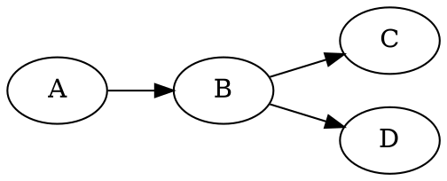

# mexdown

[](https://godoc.org/akhil.cc/mexdown)
[](https://travis-ci.org/smasher164/mexdown)
[Blog post](https://www.blog.akhil.cc/mexdown)

mexdown is a lightweight integrating markup language. It offers a syntax similar to markdown's, but its distinguishing feature is in integrating commands to generate a document.

These commands are processed through **directives**. Simply append a command to a block of raw text, like so:

````

````

[**`dot`**](https://www.graphviz.org/doc/info/command.html) is a command installed with Graphviz that reads a graph's description into standard input, and writes its SVG representation to standard output. This SVG can be embedded into an HTML document, so the following mexdown source file

````
# Title About Graphs

The following graph illustrates my point:

````

when run through mexdown's html backend either via the command line,

```
$ mexdown html graphs.xd
```

or programmatically with Go,

```
file := parser.MustParse(src)
out, err := html.Gen(file).Output()
```

produces the following HTML document


Directives enable a powerful way to control document generation, without building in new language features into markdown itself. As long as the command reads from STDIN and writes to STDOUT, you can
- Embed mathematical equations.
- Write literate programs.
- Generate hyperlinked source-code documentation.
- Create a table of contents.
- Embed interactive widgets based off descriptions.
- Use it in other creative ways!

The language itself is backend-independent, and the grammar was written with this in mind. For example, the grammar doesn't dictate the formatting of list items, the escaping of raw text, or the command language used for the directives.

## Supported Backends

Currently, the only implemented backend is HTML. However, the next candidates are
- PDF
- Postscript
- Latex
- Google Docs/Slides
- Pandoc

Anyone can implement their own backend, since it only needs the AST, as defined in [akhil.cc/mexdown/ast](https://akhil.cc/mexdown/ast).

## Contributing
Please file issues on Github's issue tracker. There is still a lot of work that needs to be done before creating a release. Thank you for taking the time to contribute!